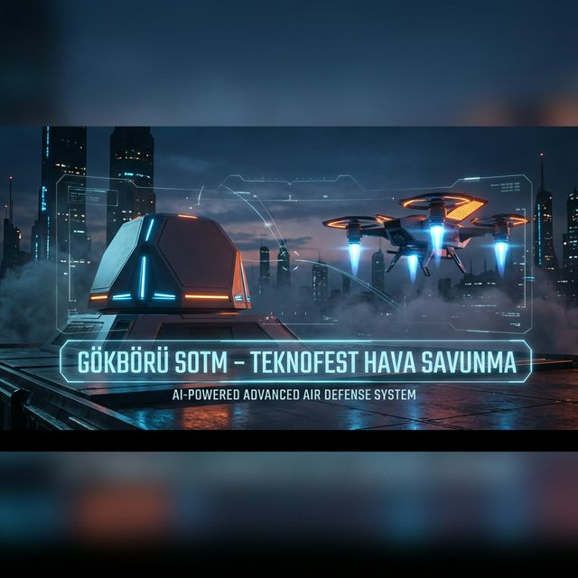
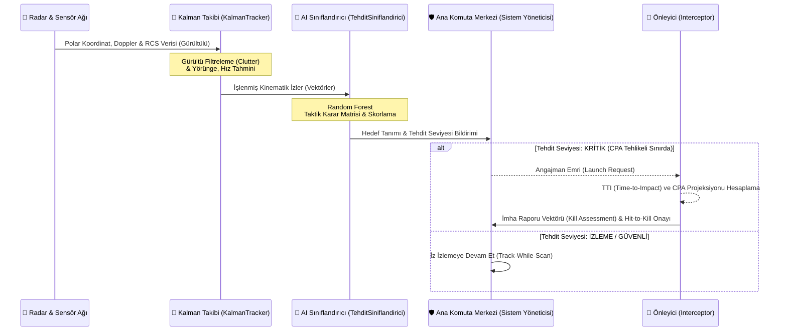

# 🛡️ ARGUS AI: Üstün Hava Savunma Doktrini ve Global Harp Ansiklopedisi

```console
[SYSTEM BOOT] Initiating ARGUS AI Core...
[SYSTEM BOOT] Loading Tactical Knowledge Base (LORE.md) ... OK
[SYSTEM BOOT] Calibrating Kalman Matrices (MATH_MODELS.md) ... OK
[SYSTEM BOOT] Powering up 3D Phased Array Radars ... OK
[SYSTEM BOOT] EW Jammer Counter-Measures ... ONLINE
[SYSTEM BOOT] C5ISR Strategic Orchestrator ... READY
[SYSTEM BOOT] ...
[SYSTEM BOOT] ARGUS AI v10.0 GÖK-VATAN STRATEGIC STANDING BY.
```
<div align="center">



[](https://github.com/bahattinyunus/teknofest_hava_savunma)
[](https://github.com/bahattinyunus/teknofest_hava_savunma/releases)
[](https://github.com/bahattinyunus/teknofest_hava_savunma)
[](https://www.python.org/)
[](LICENSE)
[](https://github.com/bahattinyunus/teknofest_hava_savunma)

<br>

> [!NOTE]
> **ARGUS Nereden Geliyor?**  
> Proje ismini Yunan mitolojisindeki **"Argus Panoptes"**ten (Her Şeyi Gören Argus) almaktadır. Yüz gözü olan ve asla tamamen uyumayan bu dev bekçi, her yöne bakabilme ve en küçük hareketi bile saptayabilme yeteneğiyle bilinir. **ARGUS AI**, çok katmanlı radar sistemleri ve 3D sensör füzyonu ile gökyüzünü her an, her yönden tarayan bu efsanevi "Sonsuz Gözü" temsil eder.

<i>"Bilginin sınırları, gökyüzünün sınırları gibidir; her ikisi de sadece ufuk çizgisine kadar değil, sonsuzluğa kadar uzanır."</i>
<br><br>

**[🏆 TEKNOFEST 2026 Çelikkubbe HSS Yarışması Uyum Raporu](docs/SARTNAME_2026.md)** <br>
**[⚔️ Taktik Zemin: Projenin Doğuş Hikayesi (LORE.md)](docs/LORE.md)** <br>
**[🧮 Çekirdek Fizik: Operasyonel Matematik (MATH_MODELS.md)](docs/MATH_MODELS.md)** 🔸 **[📘 Teknik Kılavuz (TECHNICAL_GUIDE.md)](docs/TECHNICAL_GUIDE.md)** <br>
**[⚙️ Teknik Mimari (TEKNIK_MIMARI.md)](docs/TEKNIK_MIMARI.md)** 🔸 **[Milli Teknoloji Manifestosu (MANIFESTO.md)](docs/MANIFESTO.md)**

</div>

---

## 🌍 GLOBAL BAĞLAM: Teknik Rakip Analizi ve Stratejik Kaynaklar

ARGUS AI, dünya çapında yürütülen en ileri düzey savunma ve radar teknolojileri projeleriyle aynı teknolojik vizyonu paylaşmaktadır. Aşağıda, bu alandaki küresel organizasyonların teknik derinliği ve projelerinin algoritmik altyapısı analiz edilmiştir:

### 🏆 Küresel Savunma Yarışmaları (Global Defense Challenges)
1.  **MAFAT Radar Challenge** (İsrail Savunma Bakanlığı)
    *   **Teknik Derinlik:** Doppler-pulse radar sistemlerinden gelen ham I/Q (In-phase/Quadrature) sinyallerinin spektral analizi.
    *   **Metodoloji:** Ham verinin FFT (Fast Fourier Transform) ve Hann pencerleme (windowing) ile işlenmesi; ardından **Ensemble CNN** (ResNet50, DenseNet, EfficientNet) ve **Visual Transformers (ViT)** modelleri ile %96+ doğrulukta insan/hayvan ayrımı.
    *   **Kaynak Kod:** [MAFAT-RADAR-Challenge](https://github.com/expectopatronm/MAFAT-RADAR-Challenge)
2.  **EUDIS Defence Hackathon** (Avrupa Savunma Fonu)
    *   **Operasyonel Odak:** "Defending Airspace" kapsamında otonom karşı-tedbir sistemleri.
    *   **Öne Çıkan Çözümler:** **KRÓLIK** (20.000+ örneklemli dağıtık CNN ağı) ve AI destekli kinetik önleme yapan **C-UAS BAVARIA** sistemi.
    *   **Websitesi:** [EUDIS Hackathon](https://eudis-hackathon.eu/)
3.  **NATO / NCIA Drone Identification Challenge**
    *   **Veri Bilimi:** Sürü İHA'ların mikro-Doppler imzaları üzerinden sınıflandırılması. NATO standartlarında veri füzyonu ve çoklu sensör (radar, akustik, termal) entegrasyonu simülasyonları.
    *   **Detay:** [Kaggle Challenge](https://www.kaggle.com/c/drone-identification-and-tracking)

### 🛠️ Kritik Takip ve Simülasyon Frameworkleri (Core Frameworks)
1.  **Stone Soup (Dstl - UK)**
    *   **Teknik Altyapı:** 5-Eyes ülkeleri savunma laboratuvarları tarafından geliştirilen, modüler hedef takip ve sensör füzyonu platformu.
    *   **Algoritmalar:** **Cubature Kalman Filter (CKF)**, **Multi-Hypothesis Tracking (MHT)** ve **Global Nearest Neighbour (GNN)** gibi askeri sınıf veri ilişkilendirme motorları.
    *   **GitHub:** [Stone-Soup](https://github.com/dstl/Stone-Soup)
2.  **RadarSimPy (High-Fidelity Radar Simulation)**
    *   **Performans:** C++ çekirdekli **RadarSimC** motoru ve **CUDA/GPU** hızlandırması ile saniyeler içinde satha yönelik gerçekçi (raw baseband) radar verisi üretimi.
    *   **Yetenekler:** **Ray Tracing** ile çok yollu yayılım (multi-path) ve karmaşık hedef RCS (Radar Cross Section) Swerling modelleri ile elektromanyetik ortam simülasyonu.
    *   **GitHub:** [RadarSimPy](https://github.com/radarsimx/radarsimpy)

### 🚀 Füze Güdüm ve Stratejik Harp Analizi
1.  **Proportional Navigation (PropNav) Simulations**
    *   **Kinematik:** 3-DOF nokta kütle modeli ve **Lagrange interpolasyonu** ile eksik sensör verilerinden hedef yörünge tahmini. Oransal seyrüsefer (PN) algoritmalarının Python implementasyonları.
    *   [pn-guidance](https://github.com/ajfrewin/pn-guidance) | [propNav-3DOF](https://github.com/gedeschaines/propNav)
2.  **Cognitive Electronic Warfare (vCEW)**
    *   **EW Kapasitesi:** Bilişsel elektronik harp (Cognitive EW) metotları, sahte hedef üretimi (spoofing) ve karşı-karşı tedbir (ECCM) optimizasyonu.
    *   **GitHub:** [vCEW](https://github.com/youshixun/vCEW)

---

## 🚀 PROJE VİZYONU: Modern Hava Harbinin Dijital Kalesi

**ARGUS AI**, hava savunma disiplinini bir bilgisayar simülasyonundan çok daha ötesine taşıyan, tarihsel, teknik ve stratejik boyutlarıyla ele alan **yaşayan bir yapay zeka ansiklopedisidir.** TEKNOFEST vizyonunu akademik bir derinlikle birleştirerek, savunma sanayii meraklıları ve mühendisleri için uçtan uca, askeri sınıf (military-grade) bir komuta kontrol rehberi ve simülasyon iskeleti sunar.

Sistem, elektromanyetik spektrumdaki zayıf sinyalleri yakalayarak, **Kalman Filtreleme**, **Yapay Zeka Tabanlı Tehdit Sınıflandırma** algoritmaları ve **Gelişmiş Önleyici Projeksiyonları** ile hedefleri etkisiz hale getirecek saniyenin altındaki (sub-second) reaksiyonları otonom olarak yönetmek üzere tasarlanmıştır. Projenin kalbinde, sadece kod yazmak değil; havada süzülen bir tehdidin ardındaki fiziksel mekaniği ve harp doktrinini anlamak yatar. ARGUS artık sadece komut satırında değil, WebSocket destekli entegre **Web Tabanlı Radar Paneli** (V4.0) üzerinden de komuta edilebilir.

---

## 🌌 ONTOLOJİK TEMEL: ARGUS'un Sessiz Nöbeti

*“Gözün gördüğü sadece bir akistir; hakikat, o akislerin ardındaki örüntüde saklıdır.”*

ARGUS AI, teknik bir yazılım olmanın ötesinde, gökyüzünün ontolojik egemenliğini temsil eden bir **"Dijital Gözcü"** felsefesi üzerine kurulmuştur. Bu sistemin varlık sebebi, sadece yaklaşan bir metali imha etmek değil; bir vatanın semalarındaki **huzur ve nizamın** sürekliliğini sağlamaktır.

### 1. Mutlak Uyanıklık (Teyakku)
Mitolojideki yüz gözlü Argus gibi, sistemimiz de elektromanyetik spektrumun her zerre-i miskalini tarayarak **"Adem-i Mutlak"** (yokluk) içinde var olan tehditleri bulup çıkarır. Bu, sadece bir radar taraması değil; kaosu düzene (cosmos) çeviren bir idrak sürecidir.

### 2. Sınırların Ötesindeki Sorumluluk
Hava savunması, bir milletin bağımsızlık ufkudur. ARGUS, saniyede milyonlarca hesaplama yaparken aslında şu soruyu yanıtlar: *“Varlık, kendini nasıl korur?”* Cevabımız; otonomi, hassasiyet ve sarsılmaz bir kararlılıktır. 

### 3. Bilginin Hikmeti ve Savunma
Savunma sanayiindeki teknolojik sıçrayışlar, sadece birer mühendislik başarısı değil; "Hürriyet ve İstiklal" davasının semadaki tecellisidir. ARGUS, bu verileri okuyarak semadaki nizamı muhafaza eden bir **"Dijital Muhafız"** rolü üstlenir. Bilgi güçtür, ancak o bilgi bir hayatı korumak için kullanıldığında **hikmete** dönüşür.

---

## 🔮 MİMARİ ve İŞ AKIŞI: Otonom Karar Destek Mekanizması

Aşağıda ARGUS AI sisteminin C2 (Komuta Kontrol) Merkezinde nasıl çalıştığı, sensör verilerinden hedefe angajmana kadar geçen süreç görselleştirilmiştir:



---

## 📂 PROJE ANATOMİSİ: Askeri Sınıf Yazılım Hiyerarşisi

Sistem mimarisi, monolitik yapılardan uzak durularak tamamen modüler ve mikro-servis mantığına yakın bir nesne yönelimli yapıda (OOP) tasarlanmıştır. Her bir Python dosyası, modern bir hava savunma bataryasının dijital izdüşümüdür:

```text
teknofest_hava_savunma/
├── docs/                   # 📚 Doktrinler, Ansiklopediler, Mimari Notlar
│   ├── TEKNIK_MIMARI.md    # Matematiksel sensör modelleri ve formüller
│   ├── MATH_MODELS.md      # 🧮 Kalman, SNR ve PN Formülleri (LaTeX)
│   ├── LORE.md             # 🌌 Sistemin Felsefesi ve Harp Tarihçesi
│   ├── banner.png          # ARGUS Görsel Sancağı
│   └── MANIFESTO.md        # Sistemin felsefesi ve hedef kitlesi
├── src/                    # 🧠 ARGUS AI Çekirdek Kodları
│   ├── main.py             # C2 (Komuta-Kontrol) Karar Merkezi (Orkestratör)
│   ├── radar.py            # Elektromanyetik Sinyal & Sensör Simülasyonu (AESA/PESA)
│   ├── kalman_takip.py     # Hassas İz ve Yörünge Filtreleme (Kalman Filter)
│   ├── tehdit_siniflandirici.py # AI/ML Tabanlı Tehdit Skorlama & Kimlik (IFF)
│   ├── strategic_analyzer.py # 📡 NEW: Strategic Decision Engine (C5ISR)
│   ├── interceptor.py      # Güdüm, TTI (Time-to-Impact) ve Önleme Matrisleri
│   ├── telemetry.py        # Canlı Operasyonel Veri Kaydı ve Kara Kutu (Blackbox)
│   ├── api.py              # 🌐 V4.0+: FastAPI & WebSocket C2 İletişim Sunucusu  
│   ├── static/             # 🌐 UI Phase 10: Obsidian Gold WebGL Dashboard
│   └── utils.py            # Aerodinamik Matris Sabitleri, Fonksiyonlar & Çeviriciler
├── tests/                  # 💥 Muharebe Öncesi Sanal Atış ve Test Sahası
│   └── test_simulasyon.py  # Ünit, Yük ve Çarpışma Entegrasyon testleri (pytest)
├── .github/workflows/      # ⚙️ Military-Grade CI/CD Code Analysis (Linting)
├── CODE_OF_CONDUCT.md      # 🛡️ Askeri Disiplin ve Geliştirici Kuralları
├── LICENSE                 # ⚖️ MIT Lisansı
├── requirements.txt        # 📦 Python Bağımlılık Bildirimi (Ortam İzolasyonu)
└── README.md               # 📜 İstihbarat ve Proje Brifingi (Şu an buradasınız!)
```

---

## ⚡ 1. BÖLÜM: Bilişim Devrimi İçinde Hava Savunma

ARGUS AI, pürüzsüz bir spektrum yönetimi sunarken, donanımsal radar çalışma prensiplerini yazılımsal parametrelere indirger:

*   **Çok Bantlı Simülasyon (L, S, X, Ku Bandı):** Farklı frekanslarda sahte taramalarla erken uyarı (Early Warning) veya hassas hedef kilitlenmesini (Target Lock) simüle eder. L bandı uzun menzilde geniş resim verirken, X bandı füze hedefe yaklaşırken santimetrik hassasiyet sunar.
*   **Stealth (Görünmezlik) & RCS (Radar Kesit Alanı):** Sistem, hedeflerin düşük RCS (Radar Cross Section) profillerini - örneğin seyir füzeleri veya 5. nesil savaş uçakları - tespit etmek için sinyal-gürültü oranını (SNR) analiz eden ileri düzey altyapıya sahiptir.
*   **ECCM (Electronic Counter-Counter Measures) Kapasitesi:** Düşman "Jammer" (Sinyal Karıştırıcı) faaliyetlerini göğüsleyebilmek için, asimetrik veri sinyallerini filtreleyip, "Sidelobe Blanking" yeteneklerinin temellerini barındırır.

---

## 🎯 2. BÖLÜM: Üst Düzey Karar Destek & YZ Derinlikleri

Binlerce veri noktasını ve elektromanyetik yansımayı alıp süzmek yetmez. ARGUS'ın AI Çekirdek Filtreleri, veriyi anlama dönüştürür.

### 2.1 Makine Öğrenmesi ile IFF (Dost-Düşman Tanıma)
Sistemimiz, `scikit-learn` tabanlı bir **Random Forest (Rastgele Orman)** modeli kullanarak uçuş profillerini analiz eder.
*   **Model Özellik Çıkarımı:** Sistem sadece hedefin anlık hızını değil; ivmesini (G-Kuvveti), yükseklik değişim profilini ve radar kesit alanını eşzamanlı olarak modele sokar.
*   **Davranışsal Skorlama:** Düşük hız ve sabit irtifa genellikle bir mini-UAV/Drone olarak etiketlenirken; çok yüksek sesten hızlı uçan, düz uçmasına rağmen araziye yakın seyreden bir hedef **Seyir Füzesi (Cruise Missile)** olarak klasifiye edilir.

### 2.2 Kalman Filtresi Mekaniği
Gerçek dünyada radarlar kusursuz sinyal göndermez. Yağmur, bulutlar, kuş sürüleri ve çevresel manyetik parazitler (Clutter) hedefin konumunu hatalı gösterebilir. Bu sorunu şöyle aşıyoruz:
-   **Durum Vektörü Tahmini (State Prediction):** Bir önceki konum, hız ve ivme matrislerinden yararlanarak hedefin 1 saniye sonraki tahmini konumunu bulur.
-   **Ölçüm Güncellemesi (Measurement Update):** Radardan gelen "gürültülü" yeni ölçüm ile kendi tahmini arasında "Kalman Kazancı" (Kalman Gain) oranında bir denge kurar. Sonuç: Titremeyen, pürüzsüz ve gerçekçi bir vektörel rota.

---

## 🛡️ 3. BÖLÜM: Angajman Döngüsü & Kritik Metrikler

Bir tehdit tespit edildiğinde, sistem saniyeler içerisinde "Ateşle veya Bekle" (Shoot/No-Shoot) kararını vermelidir. Bu karar mekanizması şu hayati metriklere dayanır:

| Metrik Kısaltması | Operasyonel Tanımı | Sistematik Kural Seti |
| :--- | :--- | :--- |
| **CPA (Closest Point of Approach)** | Hedefin yörüngesinin radara/tesise olan en yakın teğet noktası. | Eğer CPA, belirlenen güvenli angajman yarıçapının (örn: 15km) altına inecekse, sistem önleyici füze fırlatmayı **KRİTİK** olarak planlar. |
| **TTI (Time To Impact)** | Çarpışma veya hedefe varma süresi. | 0 < TTI < 30 saniye ise anında angajman emri verilir. |
| **Pk (Probability of Kill)** | Tek bir önleyici füzenin hedefini imha etme olasılığı. | Pk düşük hesaplanırsa (hedef çok manevra yapıyorsa), sistem hedefe **Çift Atış (Shoot-Shoot)** doktrinini uygulayarak iki füze kaldırabilir. |

---

## 🌪️ 4. BÖLÜM: Gelişmiş Tehdit Senaryoları (Advanced Threats)

ARGUS, statik hedefleri vurmak için değil, günümüzün asimetrik ve karmaşık savaş sahası senaryoları için kurgulanmıştır:

### 4.1 Sürü İHA Saldırıları (Drone Swarms)
-   **Tanım:** Aynı anda 50-100 adet düşük maliyetli kamikaze dronun (Loitering Munition) tek bir hedefe dalış yapması.
-   **Savunma Yaklaşımı:** ARGUS, tüm sürü üyelerini tekilleştirmek (Track Splitting) yerine önceliği, formasyon merkezine veya bataryaya en hızlı yaklaşana (Minimum TTI) verir. Satha yönelik hızlı mühimmat tüketimi kontrol edilir.

### 4.2 Balistik Füze (TBM & ICBM) Tespiti
-   **Tanım:** Atmosfer dışına çıkarak yüksek parabolik bir yörünge izleyen devasa hızlardaki roketler.
-   **Savunma Yaklaşımı:** Klasik hava hedeflerinden ziyade, yerçekimi ivmesi ve yanma sonu hızı hesaplarına göre çok önceden düşüş noktası projeksiyonu çizmek gerekir. ARGUS'ın `interceptor` motorunda Exospheric (atmosfer dışı) kinetik önleme konseptleri simüle edilmektedir.

### 4.3 Elektronik Harp (Jamming) & Sinyal Karıştırıcılar
-   **Tanım:** Özel modifiye edilmiş savaş uçaklarının hedefe radar "hayaletleri" yansıtması (`is_ghost`).
-   **Savunma Yaklaşımı:** ARGUS'ın radar modülü bunu anında tespit eder, ekranda siberpunk bir uyarı fırlatır (`WARNING: EW JAMMING DETECTED`) ve "Glitching" efektiyle komutanı, hedefin sahte olabileceğine karşı uyarır.

### 4.4 Lazer Nokta Savunma (CIWS)
-   **Tanım:** Kinetik füzelerin tükendiği veya aşırı yakına giren hedefler için 15km menzilli Işık Hızı silahları.
-   **Savunma Yaklaşımı:** BVR (Görüş Ötesi) çarpışmalar yeterli olmadığında ARGUS, 3D Taktik Sahada yeşil `THREE.Line` lazerlerini ateşleyerek hedefi anında imha eder. Füzeler tükense de lazer jeneratörü ateş etmeye devam eder.

### 4.5 Elektromanyetik Darbe (EMP) Silahı
-   **Tanım:** Kritik üs savunmasının çöktüğü anlarda başvurulan devasa bir taktiksel enerji darbesi.
-   **Savunma Yaklaşımı:** Komuta merkezindeki C2 butonundan EMP tetiklendiğinde, radar hava sahasındaki tüm elektronik hedefler anında kavrulur. Taktik ekran muazzam bir flaşla (Whiteout) sarsılır ve ağır bir bas frekans (SFX) yayılır.

### 4.6 Web Audio API ile Prosedürel Ses Sentezi (SFX)
- Statik mp3 dosyaları yerine, doğrudan kod ile osilatör titreşimleri (Sine, Square, Sawtooth dalgaları) yaratılarak **Radar Taraması**, **Gelecek Kritik Füze Alarmları** ve **Lazer Atışları** anlık olarak seslendirilir.

### 4.7 Dinamik Hava Durumu (Weather Attenuation) Sistemi
-   **Tanım:** Gerçek dünya meteorolojik şartlarının donanıma olan fiziksel etkisinin simüle edilmesi.
-   **Taktik Etki:** C2 paneline eklenen "TROPICAL STORM" butonu ile hava bozduğunda, Yağmur partikül motoru anında WebGL'de görselleşir. Yağmur, X-Band radar frekanslarında havada 0.4 dB/km **Sinyal Karartması (Attenuation)** yaratarak hedef tespit menzilini ciddi ölçüde düşürür. Kör uçuş başlar, hedefler ekranda yanıp sönmeye başlar.

### 4.8 Çoklu Ajan Boids Algoritması (Zeki İHA Sürüsü)
-   **Tanım:** Geleneksel rotalı İHA'lar yerine biyo-ilhamlı (Bio-inspired) zeki sürü otonomisi.
-   **Gelişmiş Yapay Zeka:** C2'den Sürü saldırısı tetiklendiğinde düşman birimleri merkeze dümdüz uçmaz. Kuş sürüleri (Flocking) gibi kendi aralarında **Ayrılma (Separation)**, **Hizalanma (Alignment)** ve **Birleşme (Cohesion)** vektörel kurallarına uyarak otonom kıvrak manevralar yaparlar.

### 4.9 "Kör Ebe" (Blindman's Buff) EW Taktikleri
-   **Anti-Radyasyon Füzeleri (ARM):** EH platformları radara çok yaklaştığında hedefe (merkeze) inanılmaz hızlarda hipersonik Anti-Radyasyon Füzeleri ateşler. ARM'ler 3D ekranda mor renkte belirir ve radarı vurursa sistemi çökertir (Kritik EMP).
-   **Radar Susturma (Emission Control):** ARM saldırılarından korunmak için C2 panelindeki `RADAR EMISSION` butonuna basılarak radar anlık olarak susturulabilir. Bu sırada ARM'ler hedefini kaybedip boşa uçar, ancak radar tüm hava sahasına KÖR olur. Savaş alanının en büyük taktik hamlesi!
-   **Chaff (Aldatıcı) Sistemleri:** Füze düşman HSS'lerine 15 km yaklaştığında, hedefler %30 ihtimalle arkalarında otonom **Parlak Gümüş Chaff Partikül Bulutu** bırakır. Önleyici füze bu Chaff'a kilitlenip havada boş yere patlayabilir. Gerçek bir teknoloji harikası.

---

### 4.10 Hipersonik Tehditler (Mach 5+)
-   **Tanım:** Geleneksel füzelerin yakalayamayacağı kadar hızlı (Mach 5 - Mach 8) seyreden gelişmiş mühimmatlar.
-   **Savunma Yaklaşımı:** ARGUS v10.0, hipersonik hedeflerin yüksek ısı imzasını ve plazma izini simüle eder. Radar modülündeki `is_hypersonic` bayrağı ile bu hedefler anında tespit edilir ve C2 paneline "HYPERSONIC ALERT" uyarısı düşer.

### 4.11 Stratejik Analiz ve C5ISR Orkestrasyonu
-   **Tanım:** Sadece hedefleri vurmak yerine, tüm savaş sahasını bir ağ olarak analiz etmek.
-   **Savunma Yaklaşımı:** `StrategicAnalyzer` modülü; batarya mühimmat durumunu, ağdaki diğer dost ünitelerin (VATAN-1, VATAN-2) sağlığını ve genel tehdit yoğunluğunu analiz ederek milisaniyelik stratejik direktifler (Örn: `RADAR_SILENCE`, `SWARM_EMERGENCY`) üretir.

---

## 📡 5. BÖLÜM: Ağ Merkezli Harp (NCW) ve Siber Güvenlik Doktrinleri (C5ISR)

Modern hava savunması, füzelerin ne kadar hızlı uçtuğundan çok, bilginin birimler arasında ne kadar hızlı ve güvenli dolaştığına bağlıdır. ARGUS AI, askeri standartlarda C5ISR (Command, Control, Computers, Communications, Cyber, Intelligence, Surveillance, and Reconnaissance) mimarisine doğru evrilmektedir:

### 5.1 Sıfır Güven Mimarisi (Zero Trust Architecture)
Sistem içindeki hiçbir alt donanım (Radar, Atış Kontrol Bilgisayarı, Batarya veya Dış Telemetri Akışı) doğuştan güvenilir kabul edilmez.
- **Kriptografik İmzalar:** Karar mekanizmasının ürettiği tüm "Launch" (Ateşle) vektörleri asimetrik şifreleme ile onaylanmalıdır. Düşman sızmalarıyla radarda görünen "hayalet uçaklar" veya yanlış ateşleme emirleri (Spoofed Launch Commands) engellenir.
- **Ağ İzolasyonu (Air Gapping):** V4.0'da geliştirilen WebSockets arayüzü, doğrudan çekirdek sisteme yazı yazamaz (Read-Only State).

### 5.2 Sensör Füzyonu ve Bilişsel Radarlar (Cognitive Radars)
Sadece Kalman Filtresi değil, yapay zekanın radyo dalgalarıyla doğrudan iletişim kurduğu **Sensör Füzyonu** devrinin kapıları aralanıyor:
- **RF Zeka (Radio Frequency Intelligence):** Hedefin yalnızca radar yansıması değil, emitör sınıfı (üzerindeki elektronik cihazların frekans salınımı) dinlenerek teşhis edilir (ESM - Elektronik Destek Tedbirleri).
- **Adaptif Dalga Şekillendirme:** ARGUS, hedefin hızına göre radar dalga boyunu mikro saniyeler içinde değiştirerek karşı taraftaki tehdidin RWR (Radar Uyarı Alıcısı) sistemlerini aldatmayı hedefler.

---

## 🔤 6. BÖLÜM: Profesyonel Terimler Ansiklopedisi (A-Z)

Projeyi teknik derinliğiyle kavrayabilmek için askeri jargon:

| Terim | Kategori | Detaylı Tanım |
| :--- | :--- | :--- |
| **AESA/PESA** | Donanım | Aktif/Pasif Elektronik Taramalı Dizi Radarlar. Ekranı döndürmek yerine elektron demetlerini çevirir, ekstrem hızda tarama yaparlar. |
| **BVR** | Operasyonel | *Beyond Visual Range*. Görüş ötesi menzil; komuta merkezinin gözle görülmeyen kilometrelerce ötedeki tehdide müdahalesi. |
| **CEP** | Balistik | *Circular Error Probable*. Önleyici mühimmatın ya da hedefin isabet hassasiyetinin istatistiksel sapma (hata) dairesi. |
| **Chaff & Flare** | Karşı Tedbir | Düşmanın radarı (Chaff) veya kızılötesi füzeleri (Flare) aldatmak için havaya saçtığı aldatıcı unsurlar. |
| **Jamming / Spoofing**| Harp (EW) | Düşman radarlarını veya askeri iletişimi kör etmeye, yanıltmaya yarayan elektron spektrumu taarruzları. |
| **IFF Mode 5** | Güvenlik | Modern standartlarda yüksek kriptolu Dost-Düşman (Identification Friend or Foe) sorgulama ve cevaplama sistemi. |
| **Hit-to-Kill** | Angajman | Füzenin hedefin yakınında patlamak (Proximity) yerine, doğrudan kinetik enerjiyle hedefin gövdesine çarpıp onu yok etmesi prensibi. |

---

## 🛣️ 7. BÖLÜM: GELECEK VİZYONU VE YOL HARİTASI (ROADMAP)

ARGUS AI, durağan bir sistem değil, sürekli gelişen bir organizmadır. Planlanan büyük güncellemeler:

- [x] **v1.0**: Temel Radar ve Önleyici yapısının kurulması.
- [x] **v2.0**: Kalman Filtresi ile yörünge tahmini ve düzeltme adaptasyonu.
- [x] **v3.0**: AI Destekli Tehdit Sınıflandırıcı (Random Forest) ve Telemetri eklentisi.
- [x] **v4.0 (YENİ)**: Gerçek zamanlı 2D Animasyonlu Radar Arayüzü (Web-tabanlı, FastAPI + WebSockets) ve Sürü İHA Senaryoları.
- [ ] **v5.0**: Çoklu Batarya Ağı (Network-centric warfare) simülasyonu. Başka sunucularla Soket iletişimi kurarak ortak hava resmi (Recognized Air Picture - RAP) oluşturma.
- [ ] **v6.0**: RL (Reinforcement Learning) tabanlı füze manevra optimizasyonu.

---

## 🤝 8. BÖLÜM: KATKIDA BULUNMA (CONTRIBUTING)

Açık kaynak savunma yazılımlarına inanan herkesin bu projeye katkı sunmasını teşvik ediyoruz! Sistemi daha iyi hale getirmek için:
1. Bu repoyu **Fork**'layın.
2. Kendinize yeni bir branch oluşturun: `git checkout -b feature/YeniHarikaAlgoritma`
3. Değişikliklerinizi yapıp commit'leyin: `git commit -m "feat: X bant radarı için Doppler etkisi düzeltildi"`
4. Forkladığınız repoya pushlayın: `git push origin feature/YeniHarikaAlgoritma`
5. GitHub üzerinden bir **Pull Request (PR)** açın.

Lütfen açtığınız PR'larda eklediğiniz algoritmanın kısa bir askeri/matematiksel izahını yazmayı unutmayın.

---

## ⚙️ HIZLI BAŞLANGIÇ: Operasyonel Başlatma Protokolü

Sistemi lokal biriminizde (Localhost) ayağa kaldırmak ve C2 Komuta Merkezini çalıştırmak için terminalinizde aşağıdaki yönergeleri izleyin:

### 1) Sektörel Üs Kurulumu

Projeyi donanımınıza klonlayın ve klasöre girin:
```bash
git clone https://github.com/bahattinyunus/teknofest_hava_savunma.git
cd teknofest_hava_savunma
```

### 2) Mühimmat ve Sensör Uyumlandırılması (Dependencies)

ARGUS AI, yüksek performanslı matris çarpımları ve AI eğitimleri için modern Python kütüphanelerine dayanır:
```bash
# Python 3.10 veya üzeri önerilir.
pip install -r requirements.txt
```

### 3) Ünite Testleri (Sanal Poligon)
Kodun kararlılığını ölçmek için simülasyon alanına girin:
```bash
pytest tests/
```

### 4) C2 Merkezini Aktive Edin (Launch)

Karar mekanizmasını başlatıp semaları taramaya başlayın:
```bash
python src/main.py
```

### 5) Operasyonel Komuta Ekranına (GUI) Bağlanın
Ana Python dosyası çalışırken tarayıcınızı açın ve gerçek zamanlı radar verilerini izlemek için C2 Paneline bağlanın:
👉 **[http://localhost:8000](http://localhost:8000)**

---

<br/>

<div align="center">

### 👨‍✈️ MİMARİ HEYET VE VİZYON

**Bahattin Yunus Çetin**<br/>
*Kıdemli Sistem Mimarı | Vatan Savunması Yazılım Mühendisi*<br/><br/>
[](https://github.com/bahattinyunus)
[](https://www.linkedin.com/in/bahattinyunuscetin)

<br/>

**Hava savunma, bir milletin gökyüzündeki imzasıdır. ARGUS AI, bu imzanın dijital mürekkebi olmak için geliştirilmiştir.**
<br/>
<br/>
<h3 align="center"><i>"Türkiye Yüzyılı'nda, Gök Vatan Emin Ellerde!"</i></h3>
<br/>

</div>
