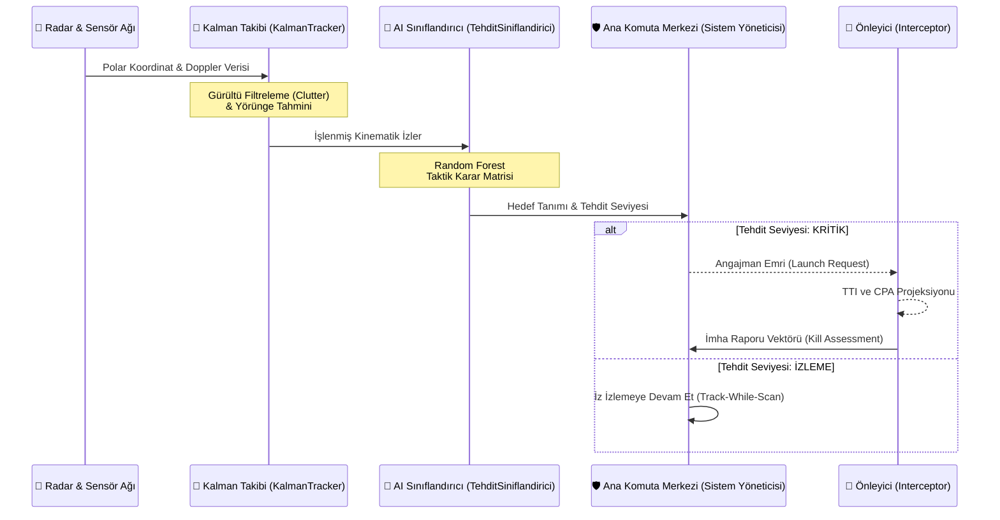

# 🛡️ GökKalkan AI: Üstün Hava Savunma Doktrini ve Global Harp Ansiklopedisi

<div align="center">


[](https://github.com/bahattinyunus/teknofest_hava_savunma)
[](https://github.com/bahattinyunus/teknofest_hava_savunma/releases)
[](https://github.com/bahattinyunus/teknofest_hava_savunma)
[](https://www.python.org/)
[](LICENSE)
[](https://github.com/bahattinyunus/teknofest_hava_savunma)

<br>
<i>"Bilginin sınırları, gökyüzünün sınırları gibidir; her ikisi de sadece ufuk çizgisine kadar değil, sonsuzluğa kadar uzanır."</i>
<br>

**[Teknik Mimari (TEKNIK_MIMARI.md)](docs/TEKNIK_MIMARI.md)** 🔸 **[Milli Teknoloji Manifestosu (MANIFESTO.md)](docs/MANIFESTO.md)**

</div>

---

## 🚀 PROJE VİZYONU: Modern Hava Harbinin Dijital Kalesi

**GökKalkan AI**, hava savunma disiplinini bir bilgisayar simülasyonundan çok daha ötesine taşıyan, tarihsel, teknik ve stratejik boyutlarıyla ele alan **yaşayan bir yapay zeka ansiklopedisidir.** TEKNOFEST vizyonunu akademik bir derinlikle birleştirerek, savunma sanayii meraklıları ve mühendisleri için uçtan uca, askeri sınıf (military-grade) bir komuta kontrol rehberi ve simülasyon iskeleti sunar.

Sistem, elektromanyetik spektrumdaki zayıf sinyalleri yakalayarak, **Kalman Filtreleme**, **Yapay Zeka Tabanlı Tehdit Sınıflandırma** algoritmaları ve **Gelişmiş Önleyici Projeksiyonları** ile hedefleri etkisiz hale getirecek saniyenin altındaki (sub-second) reaksiyonları yönetmek üzere tasarlanmıştır.

---

## 🔮 MİMARİ ve İŞ AKIŞI: Otonom Karar Destek Mekanizması

Aşağıda GökKalkan AI sisteminin C2 (Komuta Kontrol) Merkezinde nasıl çalıştığı ve hedefleri nasıl angaje ettiği görselleştirilmiştir:



---

## 📂 PROJE ANATOMİSİ: Askeri Sınıf Yazılım Hiyerarşisi

Sistem mimarisi modüler yapıya dayanır; her bir Python dosyası modern bir hava savunma doktrinindeki karşılığına denk gelir.

```text
teknofest_hava_savunma/
├── docs/                   # Doktrinler, Ansiklopediler, Mimari Notlar
│   ├── TEKNIK_MIMARI.md    # Matematiksel modeller ve algoritmalar
│   └── MANIFESTO.md        # Sistemin felsefesi ve hedef kitlesi
├── src/                    # 🧠 GökKalkan AI Çekirdek Kodları
│   ├── main.py             # C2 (Komuta-Kontrol) Karar Merkezi
│   ├── radar.py            # Elektromanyetik Sinyal & Sensör Simülasyonu
│   ├── kalman_takip.py     # Hassas İz ve Yörünge Filtreleme (Kalman Filter)
│   ├── tehdit_siniflandirici.py # AI/ML Tabanlı Tehdit Skorlama & Kimlik (IFF)
│   ├── interceptor.py      # Güdüm, TTI (Time-to-Impact) ve Önleme Matrisleri
│   ├── telemetry.py        # Canlı Operasyonel Veri Kaydı ve Loglama
│   └── utils.py            # Aerodinamik Matris Sabitleri & Çeviriciler
├── tests/                  # Muharebe Öncesi Sanal Atış ve Test Sahası
│   └── test_simulasyon.py  # Ünit ve Entegrasyon testleri 
├── LICENSE                 # MIT Lisansı
├── requirements.txt        # Python Bağımlılık Bildirimi
└── README.md               # İstihbarat ve Proje Brifingi (Şu an buradasınız!)
```

---

## ⚡ 1. BÖLÜM: Bilişim Devrimi İçinde Hava Savunma

GökKalkan AI, pürüzsüz bir spektrum yönetimi sunarken radarın çalışma prensiplerini dijital bir arayüzle kodlar.
*   **Çok Bantlı Simülasyon (L, S, X, Ku Bandı):** Farklı frekanslarda sahte taramalarla erken uyarı veya hedef kilitlenmesini gerçeğe uygun şekilde simüle eder.
*   **Stealth & RCS (Radar Kesit Alanı):** Güçlü filtreleme algoritmaları, hedeflerin (örneğin seyir füzeleri veya 5. nesil savaş uçakları) düşük RCS (Radar Cross Section) profillerini bile tespit etmemize olanak tanır.
*   **ECCM (Electronic Counter-Counter Measures):** Düşman "Jammer" faaliyetlerini engelleyecek sidelobe blanking ve frekans atlama gibi yazılımsal altyapılar geliştirme vizyonuna sahiptir.

---

## 🎯 2. BÖLÜM: Üst Düzey Karar Destek & Angajman Algoritmaları

Hedef tespiti sonrası milisaniyeler içerisinde binlerce işlem yapan GökKalkan'ın AI Çekirdek Filtreleri:

| Algoritma | Kısa Tanım | Teknik Boyut |
| :--- | :--- | :--- |
| **CPA Analizi** | *Closest Point of Approach* | Radarın/merkezin en korunmasız noktasından sızmaları önlemek için geometrik teğet ve vektör projeksiyonu. |
| **TTI Hesaplama** | *Time To Impact* | Hedefin Hız, İvme, Yükseklik verisini alarak milisaniyelik çarpışma/vurma anı hesaplaması. |
| **YZ Sınıflandırma** | *Random Forest Kimlik* | Hedefin doğrusal (Füze), pırpır/yavaş (Drone) veya manevralı (Uçak) oluşuna göre kimlik ataması. |

---

## 🔤 3. BÖLÜM: Profesyonel Terimler Ansiklopedisi (A-Z)

| Terim | Kategori | Detaylı Tanım |
| :--- | :--- | :--- |
| **BVR** | Operasyonel | *Beyond Visual Range*. Görüş ötesi menzil, devasa radarlarla düşmanın çok uzaktan tespiti. |
| **CEP** | Balistik | *Circular Error Probable*. Bir hedefin/mühimmatın isabet hassasiyetinin istatistiksel yanılma payı. |
| **Jamming / Spoofing** | Harp (EW) | Düşman radarlarını veya iletişimi kör etmeye yarayan, elektron spektrumu saldırıları. |
| **IFF Mode 5** | Güvenlik | Modern NATO standartlarında yüksek kriptolu dost-düşman (Identification Friend or Foe) sorgulama sistemi. |

---

## ⚙️ HIZLI BAŞLANGIÇ: Operasyonel Başlatma Protokolü

Sistemi kendi lokal biriminizde ayağa kaldırmak ve C2 Komuta Merkezini çalıştırmak için terminalinizde aşağıdaki yönergeleri izleyin:

### 1) Sektörel Üs Kurulumu

Projeyi kendi donanımınıza klonlayın ve içine girin:
```bash
git clone https://github.com/bahattinyunus/teknofest_hava_savunma.git
cd teknofest_hava_savunma
```

### 2) Mühimmat ve Sensör Uyumlandırılması (Dependencies)

GökKalkan AI; veri analizi için `NumPy`, makine öğrenmesi için `scikit-learn` ve modern konsol tasarımı için `rich` kütüphanelerine ihtiyaç duyar:
```bash
pip install -r requirements.txt
```

### 3) Komuta Merkezini Aktive Edin (Launch)

Karar merkezini başlatın ve radar taramasına başlayın:
```bash
python src/main.py
```

---

<br/>

<div align="center">

### 👨‍✈️ MİMARİ HEYET VE VİZYON

**Bahattin Yunus Çetin**<br/>
*Kıdemli Sistem Mimarı | Vatan Savunması Yazılım Mühendisi*<br/>
📍 *Of / Trabzon'un Dijital Siperlerinden...*<br/><br/>
[](https://github.com/bahattinyunus)
[](https://www.linkedin.com/in/bahattinyunuscetin)

<br/>

**Hava savunma, bir milletin gökyüzündeki imzasıdır. GökKalkan AI, bu imzanın dijital mürekkebi olmak için geliştirilmiştir.**
<br/>
<br/>
<h3 align="center"><i>"Türkiye Yüzyılı'nda, Gök Vatan Emin Ellerde!"</i></h3>
<br/>

</div>
