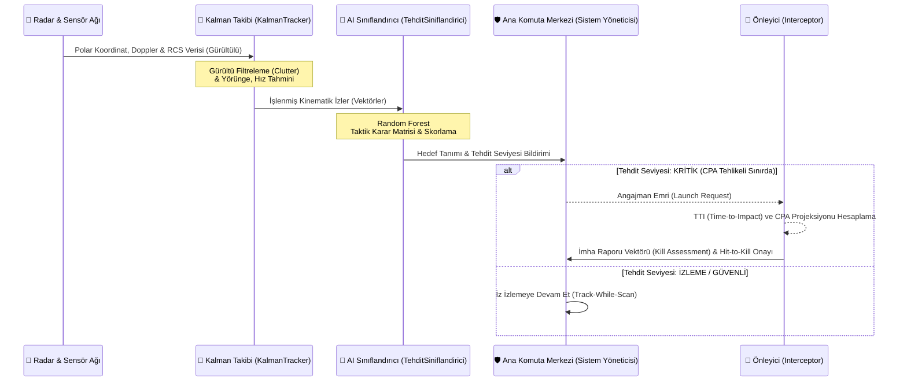

# 🛡️ GökKalkan AI: Üstün Hava Savunma Doktrini ve Global Harp Ansiklopedisi

<div align="center">


[](https://github.com/bahattinyunus/teknofest_hava_savunma)
[](https://github.com/bahattinyunus/teknofest_hava_savunma/releases)
[](https://github.com/bahattinyunus/teknofest_hava_savunma)
[](https://www.python.org/)
[](LICENSE)
[](https://github.com/bahattinyunus/teknofest_hava_savunma)

<br>
<i>"Bilginin sınırları, gökyüzünün sınırları gibidir; her ikisi de sadece ufuk çizgisine kadar değil, sonsuzluğa kadar uzanır."</i>
<br><br>

**[Teknik Mimari (TEKNIK_MIMARI.md)](docs/TEKNIK_MIMARI.md)** 🔸 **[Milli Teknoloji Manifestosu (MANIFESTO.md)](docs/MANIFESTO.md)**

</div>

---

## 🚀 PROJE VİZYONU: Modern Hava Harbinin Dijital Kalesi

**GökKalkan AI**, hava savunma disiplinini bir bilgisayar simülasyonundan çok daha ötesine taşıyan, tarihsel, teknik ve stratejik boyutlarıyla ele alan **yaşayan bir yapay zeka ansiklopedisidir.** TEKNOFEST vizyonunu akademik bir derinlikle birleştirerek, savunma sanayii meraklıları ve mühendisleri için uçtan uca, askeri sınıf (military-grade) bir komuta kontrol rehberi ve simülasyon iskeleti sunar.

Sistem, elektromanyetik spektrumdaki zayıf sinyalleri yakalayarak, **Kalman Filtreleme**, **Yapay Zeka Tabanlı Tehdit Sınıflandırma** algoritmaları ve **Gelişmiş Önleyici Projeksiyonları** ile hedefleri etkisiz hale getirecek saniyenin altındaki (sub-second) reaksiyonları otonom olarak yönetmek üzere tasarlanmıştır. Projenin kalbinde, sadece kod yazmak değil; havada süzülen bir tehdidin ardındaki fiziksel mekaniği ve harp doktrinini anlamak yatar.

---

## 🔮 MİMARİ ve İŞ AKIŞI: Otonom Karar Destek Mekanizması

Aşağıda GökKalkan AI sisteminin C2 (Komuta Kontrol) Merkezinde nasıl çalıştığı, sensör verilerinden hedefe angajmana kadar geçen süreç görselleştirilmiştir:



---

## 📂 PROJE ANATOMİSİ: Askeri Sınıf Yazılım Hiyerarşisi

Sistem mimarisi, monolitik yapılardan uzak durularak tamamen modüler ve mikro-servis mantığına yakın bir nesne yönelimli yapıda (OOP) tasarlanmıştır. Her bir Python dosyası, modern bir hava savunma bataryasının dijital izdüşümüdür:

```text
teknofest_hava_savunma/
├── docs/                   # 📚 Doktrinler, Ansiklopediler, Mimari Notlar
│   ├── TEKNIK_MIMARI.md    # Matematiksel sensör modelleri ve formüller
│   ├── banner.png          # GökKalkan Görsel Sancağı
│   └── MANIFESTO.md        # Sistemin felsefesi ve hedef kitlesi
├── src/                    # 🧠 GökKalkan AI Çekirdek Kodları
│   ├── main.py             # C2 (Komuta-Kontrol) Karar Merkezi (Orkestratör)
│   ├── radar.py            # Elektromanyetik Sinyal & Sensör Simülasyonu (AESA/PESA)
│   ├── kalman_takip.py     # Hassas İz ve Yörünge Filtreleme (Kalman Filter)
│   ├── tehdit_siniflandirici.py # AI/ML Tabanlı Tehdit Skorlama & Kimlik (IFF)
│   ├── interceptor.py      # Güdüm, TTI (Time-to-Impact) ve Önleme Matrisleri
│   ├── telemetry.py        # Canlı Operasyonel Veri Kaydı ve Kara Kutu (Blackbox)
│   └── utils.py            # Aerodinamik Matris Sabitleri, Fonksiyonlar & Çeviriciler
├── tests/                  # 💥 Muharebe Öncesi Sanal Atış ve Test Sahası
│   └── test_simulasyon.py  # Ünit, Yük ve Çarpışma Entegrasyon testleri 
├── LICENSE                 # ⚖️ MIT Lisansı
├── requirements.txt        # 📦 Python Bağımlılık Bildirimi (Ortam İzolasyonu)
└── README.md               # 📜 İstihbarat ve Proje Brifingi (Şu an buradasınız!)
```

---

## ⚡ 1. BÖLÜM: Bilişim Devrimi İçinde Hava Savunma

GökKalkan AI, pürüzsüz bir spektrum yönetimi sunarken, donanımsal radar çalışma prensiplerini yazılımsal parametrelere indirger:

*   **Çok Bantlı Simülasyon (L, S, X, Ku Bandı):** Farklı frekanslarda sahte taramalarla erken uyarı (Early Warning) veya hassas hedef kilitlenmesini (Target Lock) simüle eder. L bandı uzun menzilde geniş resim verirken, X bandı füze hedefe yaklaşırken santimetrik hassasiyet sunar.
*   **Stealth (Görünmezlik) & RCS (Radar Kesit Alanı):** Sistem, hedeflerin düşük RCS (Radar Cross Section) profillerini - örneğin seyir füzeleri veya 5. nesil savaş uçakları - tespit etmek için sinyal-gürültü oranını (SNR) analiz eden ileri düzey altyapıya sahiptir.
*   **ECCM (Electronic Counter-Counter Measures) Kapasitesi:** Düşman "Jammer" (Sinyal Karıştırıcı) faaliyetlerini göğüsleyebilmek için, asimetrik veri sinyallerini filtreleyip, "Sidelobe Blanking" yeteneklerinin temellerini barındırır.

---

## 🎯 2. BÖLÜM: Üst Düzey Karar Destek & Angajman Algoritmaları

Binlerce veri noktasını ve elektromanyetik yansımayı alıp süzmek yetmez. GökKalkan'ın AI Çekirdek Filtreleri, veriyi anlama dönüştürür:

| Algoritma / Konsept | Sistematik Amacı | Teknik Yükseklik |
| :--- | :--- | :--- |
| **CPA Analizi** | *Closest Point of Approach* (En Yakın Yaklaşım Noktası) | Radarın/merkezin en korunmasız noktasından sızmaları önlemek için saniyelik vektör projeksiyonu ve 3D teğet hesabı yapar. |
| **TTI Hesaplama** | *Time To Impact* (Çarpışmaya Kalan Süre) | Hedefin Hız, İvme, Yükseklik verilerini bir denkleme oturtarak milisaniyelik çarpışma/vurma anını hesaplar. Gecikme töleransı minimaldir. |
| **YZ Sınıflandırma** | *Random Forest Kimliklendirme* | Hedefin kinematik davranışı doğrusal ise (Seyir Füzesi), yavaş ve pırpır ise (Drone) veya son anda yüksek G-Force manevrası yapıyorsa (Savaş Uçağı), ona uygun tehdit skoru atar. |
| **Kalman Filter** | *Lineer Dinamik Sistem Tahmini* | Sensörlerdeki (radar) termal ve çevresel gürültüyü (clutter) gidererek, hedefin gerçekte nerede olduğunu ve nereye gittiğini en uygun istatistikle tahmin eder. |

---

## 🔤 3. BÖLÜM: Profesyonel Terimler Ansiklopedisi (A-Z)

Projeyi teknik derinliğiyle kavrayabilmek için bazı operasyonel doktrin kavramları:

| Terim | Kategori | Detaylı Tanım |
| :--- | :--- | :--- |
| **AESA/PESA** | Donanım | Aktif/Pasif Elektronik Taramalı Dizi Radarlar. Ekstrem hızlı çevresel tarama yaparlar. |
| **BVR** | Operasyonel | *Beyond Visual Range*. Görüş ötesi menzil; komuta merkezinin gözle görülmeyen kilometrelerce ötedeki tehdide müdahalesi. |
| **CEP** | Balistik | *Circular Error Probable*. Önleyici mühimmatın ya da hedefin isabet hassasiyetinin istatistiksel sapma (hata) dairesi. |
| **Chaff & Flare** | Karşı Tedbir | Düşmanın radarı (Chaff) veya kızılötesi füzeleri (Flare) aldatmak için havaya saçtığı aldatıcı unsurlar. |
| **Jamming / Spoofing**| Harp (EW) | Düşman radarlarını veya askeri iletişimi kör etmeye, yanıltmaya yarayan elektron spektrumu taarruzları. |
| **IFF Mode 5** | Güvenlik | Modern standartlarda yüksek kriptolu Dost-Düşman (Identification Friend or Foe) sorgulama ve cevaplama sistemi. |
| **Hit-to-Kill** | Angajman | Füzenin hedefin yakınında patlamak (Proximity) yerine, doğrudan kinetik enerjiyle hedefin gövdesine çarpıp onu yok etmesi prensibi. |

---

## 🛣️ GELECEK VİZYONU VE YOL HARİTASI (ROADMAP)

GökKalkan AI, durağan bir sistem değil, sürekli gelişen bir organizmadır. Planlanan büyük güncellemeler:

- [x] **v1.0**: Temel Radar ve Önleyici yapısının kurulması.
- [x] **v2.0**: Kalman Filtresi ile yörünge tahmini ve düzeltme adaptasyonu.
- [x] **v3.0**: AI Destekli Tehdit Sınıflandırıcı (Random Forest) ve Telemetri eklentisi.
- [ ] **v4.0 (Yakında)**: Gerçek zamanlı 3D GUI (Arayüz) entegrasyonu (PyQt5 veya Web-tabanlı).
- [ ] **v5.0**: Çoklu Batarya Ağı (Network-centric warfare) simülasyonu. Başka sunucularla Soket iletişimi kurarak ortak hava resmi (Recognized Air Picture - RAP) oluşturma.
- [ ] **v6.0**: RL (Reinforcement Learning) tabanlı füze manevra optimizasyonu.

---

## 🤝 KATKIDA BULUNMA (CONTRIBUTING)

Açık kaynak savunma yazılımlarına inanan herkesin bu projeye katkı sunmasını teşvik ediyoruz! Sistemi daha iyi hale getirmek için:
1. Bu repoyu **Fork**'layın.
2. Kendinize yeni bir branch oluşturun: `git checkout -b feature/YeniHarikaAlgoritma`
3. Değişikliklerinizi yapıp commit'leyin: `git commit -m "feat: X bant radarı için Doppler etkisi düzeltildi"`
4. Forkladığınız repoya pushlayın: `git push origin feature/YeniHarikaAlgoritma`
5. GitHub üzerinden bir **Pull Request (PR)** açın.

Lütfen açtığınız PR'larda eklediğiniz algoritmanın kısa bir askeri/matematiksel izahını yazmayı unutmayın.

---

## ⚙️ HIZLI BAŞLANGIÇ: Operasyonel Başlatma Protokolü

Sistemi lokal biriminizde (Localhost) ayağa kaldırmak ve C2 Komuta Merkezini çalıştırmak için terminalinizde aşağıdaki yönergeleri izleyin:

### 1) Sektörel Üs Kurulumu

Projeyi donanımınıza klonlayın ve klasöre girin:
```bash
git clone https://github.com/bahattinyunus/teknofest_hava_savunma.git
cd teknofest_hava_savunma
```

### 2) Mühimmat ve Sensör Uyumlandırılması (Dependencies)

GökKalkan AI, yüksek performanslı matris çarpımları ve AI eğitimleri için modern kütüphanelere dayanır:
```bash
# Python 3.10 veya üzeri önerilir.
pip install -r requirements.txt
```

### 3) Ünite Testleri (Sanal Poligon)
Kodun kararlılığını ölçmek için simülasyon alanına girin:
```bash
pytest tests/
```

### 4) C2 Merkezini Aktive Edin (Launch)

Karar mekanizmasını başlatıp semaları taramaya başlayın:
```bash
python src/main.py
```

---

<br/>

<div align="center">

### 👨‍✈️ MİMARİ HEYET VE VİZYON

**Bahattin Yunus Çetin**<br/>
*Kıdemli Sistem Mimarı | Vatan Savunması Yazılım Mühendisi*<br/>
📍 *Of / Trabzon'un Dijital Siperlerinden...*<br/><br/>
[](https://github.com/bahattinyunus)
[](https://www.linkedin.com/in/bahattinyunuscetin)

<br/>

**Hava savunma, bir milletin gökyüzündeki imzasıdır. GökKalkan AI, bu imzanın dijital mürekkebi olmak için geliştirilmiştir.**
<br/>
<br/>
<h3 align="center"><i>"Türkiye Yüzyılı'nda, Gök Vatan Emin Ellerde!"</i></h3>
<br/>

</div>
