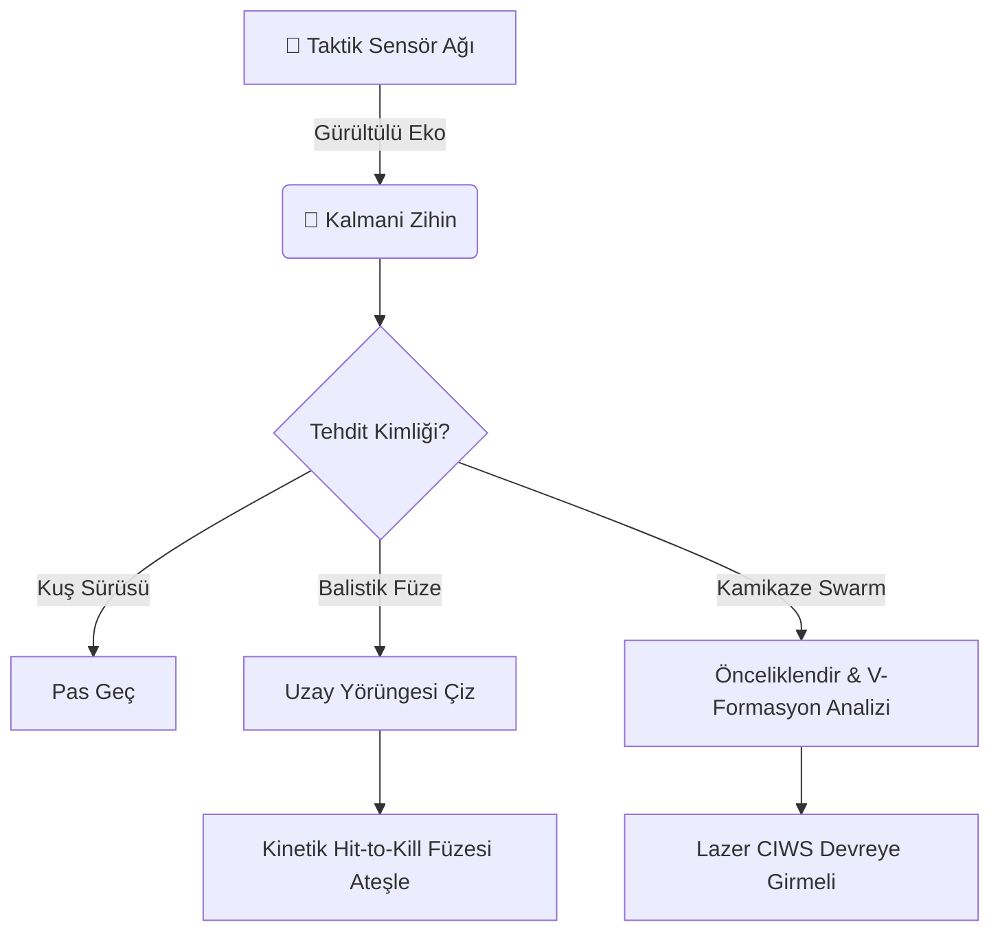

# 🌌 LORE: GökKalkan'ın Felsefesi ve Doğuşu

> *"Geleceğin savaşları siperlerde değil, spektrumlarda ve mikro saniyelerin içinde kazanılacak."*

## 🌩️ Bir Çaresizlikten Doğan İhtiyacın Kıvılcımı

Tarihsel savaş doktrinleri, her zaman "ateş gücü" ve "zırh" arasındaki o bitmek bilmez denge üzerine kurulmuştu. Ancak 21. yüzyılın çeyreği dönüldüğünde savaş sahası, daha önce hiç görülmemiş, **asimetrik** bir tehditle karşılaştı: *Loitering Munitions (Kamikaze Dronlar) ve Sürü İHA'ları.*

Devasa bütçelerle üretilen, milyon dolarlık Patriot veya S-400 füzeleri, tanesi birkaç bin dolara mal olan, sürü halinde uçan küçük plastik dronlara karşı hem ekonomik hem de operasyonel olarak çaresiz kalıyordu. Bir bataryanın 8 füzesi vardı, ufuktan ise 50 drone yaklaşıyordu. Geleneksel radarlar bu küçük hedefleri kuş sürülerinden zar zor ayırıyordu.

İşte GökKalkan, bu çaresizliğin ortasında filizlendi. Gökyüzüne kör bir kalkan germek değil, akıllı, hedef seçen, algoritmalarla örülmüş, görünmez bir **bilişsel ağ (cognitive network)** kurmak ebatlarındaydı.

## ⚙️ Paradigma Değişimi: "Demirden Algoritmaya"

GökKalkan mühendislerinin mottomu basitti: **Sistemin beyni, barutundan hızlı olmalı.**

Eski nesil hava savunmalar füzeyi hedefe "gözü kapalı" yollarken, GökKalkan füzesini yollamadan öne saniyede 1 Milyar (Gigahertz) defa düşündü:
1.  **Dinledi:** Bu cisim rüzgarda sürüklenen bir balon mu, yoksa bir seyir füzesi mi?
2.  **Hesapladı:** O cisim 30 saniye sonra tam olarak uzaydaki hangi 3 boyutlu koordinatta olacak?
3.  **Karar Verdi:** Ona elimizdeki 1.5 milyon dolarlık önleyici füzeyi mi atalım, yoksa saniyede 4500 mermi atan Nokta Savunma Lazerlerimizi (CIWS) mi bekleyelim?

## 🛰️ Ağ Merkezli Harp: Bir Makinenin Yalnızlığı ve Kalabalığı

GökKalkan sadece bir radar anteni değildi; dünyayı sayılarla, frekanslarla ve termal izlerle gören bir zihindi. 

Radar dalgalarını hedefe çarptırıp yansımasını beklerken, aslında hedefin adeta "fiziksel" tomografisini çekiyordu. Eğer ufukta bir düşman *Jammer (Sinyal Karıştırıcı)* uçağı belirip de GökKalkan'ın gözlerine kör edici elektromanyetik ışıklar yansıtmaya çalışırsa, sistemin Kalmani Filtreleri devreye giriyor, yalan ile gerçeği ayırt etmek için matematiksel bir savaşa giriyordu.

*Aşağıda, Taktik Merkezde yapay zekanın hedeflerle girdiği satranç partisinin bir yansımasını görüyorsunuz:*

## ⏳ Karar Anı: 0.4 Saniye

Sistemin başında bekleyen komutanın tek duyduğu şey, klimalı odanın uğultusu ve arada bir ekranda beliren neon yeşili ikazlardı. 

Ama o sessizliğin ardında, GökKalkan milisaniyeler içerisinde türevler alıyor, diferansiyel denklemler çözüyor, hedefin radar kesit alanını Rayleigh dağılımlarına vuruyor ve çarpışma anını (TTI) saniyenin onda biri hassasiyetle hesaplıyordu. Komutanın "Ateş Serbest" emrini verdiği o yarım saniyelik sürede, GökKalkan çoktan hedefe varmak için 4 farklı rota çizmişti bile.

Gök vatanın savunması, çeliğin sertliğinden çıkıp, **matematiğin zarafetine** bırakılmıştı.
